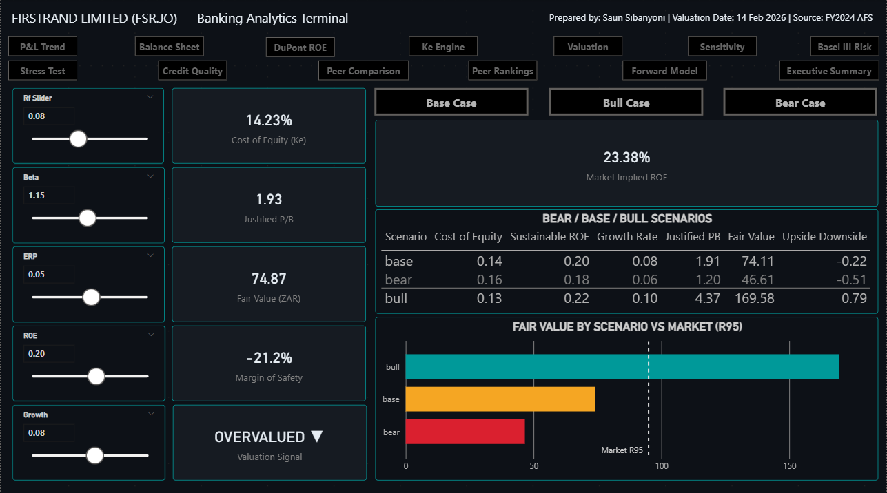
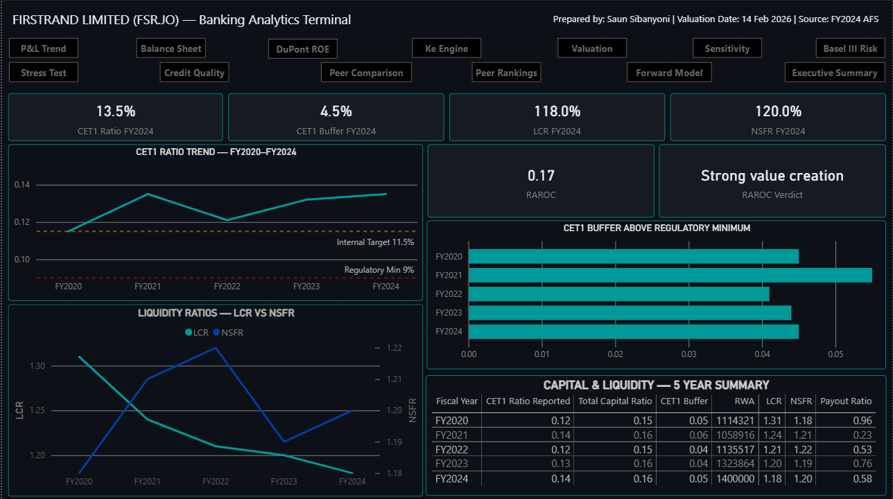
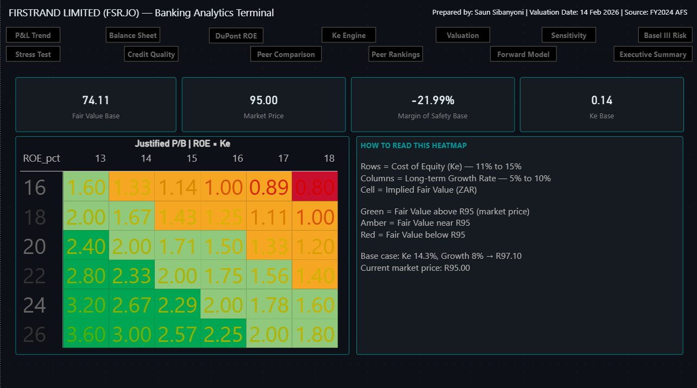

# FSR Banking Analytics Terminal
### FirstRand Limited (JSE: FSR) — Power BI Dashboard | Project 2

[](https://powerbi.microsoft.com)
[](https://www.jse.co.za)
[]()

> **Valuation verdict:** At R95.00 (2.45× book), the market implies a perpetual ROE growth of ~23.4%. The base sustainable ROE of 20.2% supports a fair value of **R74.11** — the franchise is exceptional but currently **priced for perfection**.

---

## Dashboard Preview

### Live DDM Valuation Engine — Ke Engine (Page 5)

*5-slider live cost of equity engine. Bull/Base/Bear scenario bookmarks update all 8 output cards simultaneously. Ke = 14.29% at base case inputs.*

### Basel III Capital & Risk (Page 8)

*CET1 trend vs regulatory minimum (9%) and internal target (11.5%). RAROC = 17% → Strong value creation. LCR and NSFR both above 100%.*

### Dynamic Sensitivity Heatmap (Page 7)

*Live 6×6 Justified P/B matrix driven by Ke Engine sliders. Gold cell tracks current scenario. Green-to-red scale: P/B < 1.0 (red) → P/B > 2.0 (green).*

---

## Overview

A production-grade, 14-page banking analytics terminal built in Power BI, covering FirstRand Limited's full financial profile: income statement decomposition, balance sheet trends, DuPont ROE attribution, live DDM valuation engine, Basel III capital adequacy, IFRS 9 credit quality, stress testing, peer benchmarking, and forward earnings projection.

This dashboard is the second project in the [JSE Finance & Valuation Portfolio](https://github.com/shawnanalytics/finance-valuation-portfolio), targeting Tier-1 banking equity analyst and quant roles. It is benchmarked against production-grade terminal dashboards, not student projects.

---

## Stack

| Layer | Tool |
|---|---|
| Visualisation | Power BI Desktop (Feb 2026) |
| Data modelling | Star schema — 6 fact tables, 2 dimension tables |
| Calculations | DAX — 50+ explicit measures, zero hardcodes |
| Data preparation | Power Query M |
| Source data | FSR FY2020–FY2024 Annual Financial Statements (IFRS) |
| Peer data | Published FY2024 AFS — FSR, ABG, SBK, NED, CPI |

---

## Dashboard Pages

| # | Page | Key Content |
|---|---|---|
| 1 | **Cover** | 5 KPI cards with sparkline trends, navigation hub |
| 2 | **P&L Trend** | Revenue composition, headline earnings, NIM vs CTI trend, 5-year income statement |
| 3 | **Balance Sheet** | Asset & funding trends, equity vs CET1 capital, 5-year balance sheet |
| 4 | **DuPont ROE** | Implied vs reported ROE decomposition, ROA trend, leverage multiplier, DuPont gap analysis |
| 5 | **Ke Engine** | Live 5-slider DDM cost of equity engine (Rf, Beta, ERP, ROE, g) |
| 6 | **Valuation** | Bear/Base/Bull fair value outputs, justified P/B, margin of safety, model stability warning |
| 7 | **Sensitivity** | Dynamic 6×6 Justified P/B heatmap — live, gold active-cell highlight |
| 8 | **Basel III Risk** | CET1 trend, capital buffer, LCR/NSFR liquidity ratios, RAROC card |
| 9 | **Stress Test** | 5-shock parameterised stress engine, P&L waterfall, capital adequacy verdict |
| 10 | **Credit Quality** | Stage 3 ratio, coverage ratio, CLR trend, gross loans growth |
| 11 | **Peer Comparison** | FSR vs ABG vs SBK vs NED vs CPI — 6 metrics |
| 12 | **Peer Rankings** | FSR rank by ROE, NIM, CTI, CLR, CET1, P/B |
| 13 | **Forward Model** | FY2025E–FY2027E earnings projection, NIM decomposition waterfall |
| 14 | **Executive Summary** | Investment thesis, fair value range chart, analytical commentary |

---

## Key Features

### Live DDM Valuation Engine (Page 5–7)
- 5 What-If Parameter slicers: **Rf**, **Beta**, **ERP**, **Sustainable ROE**, **Terminal Growth Rate**
- Live output cards: **Ke**, **Justified P/B**, **Fair Value (ZAR)**, **Margin of Safety**, **Market-Implied ROE**, **Valuation Signal**
- **3 scenario bookmarks**: Bull / Base / Bear — update all output cards simultaneously
- **Dynamic sensitivity heatmap**: 6×6 Justified P/B matrix (ROE × Ke) — live DAX, gold active-cell highlight tracking current slider inputs
- Denominator guard: model stability warning fires when Ke−g spread < 1%

```dax
-- Live Cost of Equity
Ke Live =
    (SELECTEDVALUE('Rf Slider'[Rf Slider Value], 7.965) / 100)
    + SELECTEDVALUE('Beta'[Beta Value], 1.15)
    * (SELECTEDVALUE('ERP'[ERP Value], 5.50) / 100)

-- Dynamic Justified P/B (with denominator guard)
Justified PB =
VAR roe = SELECTEDVALUE('ROE'[ROE Value], 20.00) / 100
VAR ke  = [Ke Live]
VAR g   = SELECTEDVALUE('Growth'[Growth Value], 8.00) / 100
VAR spread = ke - g
RETURN
    SWITCH(TRUE(),
        spread <= 0,    BLANK(),
        spread < 0.01,  BLANK(),
        ROUND(DIVIDE(roe - g, spread), 4)
    )
```

### Parameterised Stress Test Engine (Page 9)
Five independent shock sliders drive a full P&L propagation model:

| Shock Parameter | Range | Default |
|---|---|---|
| CLR Shock | 0–200 bps | 0 bps |
| NIM Shock | 0 to −100 bps | 0 bps |
| Cost Shock | 0–15% | 0% |
| RWA Shock | 0–20% | 0% |
| Equity Shock | 0–20% | 0% |

Three preset scenario bookmarks: **Base Stress / Mild Stress / Severe Stress**

Output cards: Stressed ROE, Stressed CET1 Ratio, CET1 Buffer, Stressed Earnings, Earnings Decline %, Capital Adequacy Verdict

```dax
-- Stressed Earnings (full P&L propagation)
Stressed Earnings =
    [Stressed NII]
    + [Base NIR]
    - [Stressed OpEx]
    - [Stressed Impairments]

-- Capital Adequacy Verdict (traffic light)
Capital Adequacy Verdict =
VAR buf = [Stressed CET1 Buffer]
RETURN
    SWITCH(TRUE(),
        buf > 0.04, "RESILIENT",
        buf > 0.02, "ADEQUATE",
        buf > 0.00, "ABOVE MINIMUM",
        "BREACH")
```

### Basel III Risk Page (Page 8)
- CET1 Ratio trend vs regulatory minimum (9%) and internal target (11.5%)
- CET1 buffer above minimum — 5-year history
- LCR vs NSFR liquidity ratio trends
- **RAROC card**: Risk-adjusted return on CET1 capital
- **RAROC Verdict**: Automated signal (Strong value creation / Adequate / Low / Breach)

```dax
RAROC =
DIVIDE(
    CALCULATE(SUM(FactIncomeStatement[HeadlineEarnings]), DimYear[YearKey] = 2024)
    - CALCULATE(SUM(FactIncomeStatement[CreditImpairments]), DimYear[YearKey] = 2024),
    CALCULATE(SUM(FactBalanceSheet[CET1Capital]), DimYear[YearKey] = 2024)
)
```

### DuPont ROE Decomposition (Page 4)
- Implied ROE (ROA × Financial Leverage) vs Reported ROE — 5-year comparison
- DuPont Gap measure: surfaces divergence between decomposed and published ROE
- ROA trend with SA banking industry benchmark band (1.8%–2.2%)
- Financial leverage trend (Avg Assets / Avg Equity)
- 5-year average ROE and ROE volatility (StdDev) KPI cards

### Peer Comparison (Pages 11–12)
Six metrics benchmarked across 5 JSE-listed banks (FY2024 published AFS):

| Metric | FSR | ABG | SBK | NED | CPI |
|---|---|---|---|---|---|
| ROE | 20.2% | ~17.5% | ~18.1% | ~15.8% | ~27.5% |
| NIM | 4.47% | ~4.10% | ~3.89% | ~3.75% | ~7.20% |
| CTI | 52.6% | ~54.2% | ~55.0% | ~56.8% | ~36.5% |
| CET1 | 13.5% | ~12.9% | ~13.2% | ~12.1% | ~45.8% |

*Peer figures sourced from published FY2024 Annual Financial Statements. Verify against source before use.*

### Forward Earnings Model (Page 13)
- Three forward assumption sliders: NIM Forward (bps), CLR Forward (%), Cost Growth (%)
- FY2025E / FY2026E / FY2027E ROE projections
- Actuals-to-estimates earnings timeline chart (solid → dashed line at FY2024)
- NIM decomposition waterfall: Gross Loan Yield → Funding Mix Drag → Impairment Drag → Net Risk-Adjusted NIM

---

## Data Model

```
DimYear (1) ──────────────── (∞) FactIncomeStatement
DimYear (1) ──────────────── (∞) FactBalanceSheet
DimYear (1) ──────────────── (∞) FactCapitalRisk
DimYear (1) ──────────────── (∞) FactCreditQuality
DimYear (1) ──────────────── (∞) FactKeyRatios
DimYear (1) ──────────────── (∞) FactValuation
DimPeer (1) ──────────────── (∞) FactPeerMetrics

Disconnected (no relationships):
├── Rf Slider         [What-If Parameter]
├── Beta              [What-If Parameter]
├── ERP               [What-If Parameter]
├── ROE               [What-If Parameter]
├── Growth            [What-If Parameter]
├── CLR Shock         [What-If Parameter]
├── NIM Shock         [What-If Parameter]
├── Cost Shock        [What-If Parameter]
├── RWA Shock         [What-If Parameter]
├── Equity Shock      [What-If Parameter]
├── HeatmapAxis_ROE   [Sensitivity axis]
├── HeatmapAxis_Ke    [Sensitivity axis]
└── _Measures         [All 50+ DAX measures]
```

---

## Valuation Summary (Base Case — FY2024)

| Output | Value |
|---|---|
| Risk-Free Rate (Rf) | 7.965% |
| Beta | 1.15 |
| Equity Risk Premium | 5.50% |
| **Cost of Equity (Ke)** | **14.29%** |
| Sustainable ROE | 20.0% |
| Terminal Growth Rate | 8.0% |
| **Justified P/B** | **1.91×** |
| **Fair Value (Base)** | **R74.11** |
| Market Price | R95.00 |
| **Margin of Safety** | **−21.99%** |
| **Valuation Signal** | **OVERVALUED** |

| Scenario | Ke | Fair Value | Signal |
|---|---|---|---|
| Bear | 16.00% | R46.61 | OVERVALUED |
| Base | 14.29% | R74.11 | OVERVALUED |
| Bull | 12.75% | R169.58 | UNDERVALUED |

---

## Key Findings

**Profitability:** 5-year average ROE of 19.7% (StdDev: 1.29%) demonstrates earnings stability through COVID-19 and the rate cycle. FY2024 ROE moderation to 20.2% reflects rising credit costs and cost pressure, not structural deterioration.

**Efficiency:** CTI rose from 50.3% (FY2022) to 53.6% (FY2024) — a 330bps deterioration. Operating jaws need to re-open for ROE to sustain above 20%.

**Credit & Capital:** CLR normalising from 0.62% trough (FY2022) to 0.94% (FY2024). CET1 at 13.5% provides 450bps buffer above regulatory minimum — balance sheet is not capital-constrained. RAROC = 17% → Strong value creation.

**Valuation:** At R95.00 (2.45× book), the market implies a perpetual ROE growth of ~23.4%. The base case fair value of R74.11 suggests the stock is pricing in a bull-case outcome at base-case risk. Weight the base case.

---

## DAX Standards

- ✅ Zero hardcoded values — all assumptions via What-If Parameters
- ✅ Zero `PREVIOUSYEAR()` on text columns — YoY uses integer `YearKey` arithmetic
- ✅ All measures in dedicated `_Measures` table
- ✅ No raw `Sum of [Column]` aggregations on ratio metrics
- ✅ Denominator guard on all Gordon Growth / DDM calculations
- ✅ Scenario bookmarks capture Data state only (not visual selection)

---

## Project Context

| | Project 1 | Project 2 |
|---|---|---|
| **Company** | Shoprite Holdings (SHP.JO) | FirstRand Limited (FSR.JO) |
| **Sector** | JSE Retail / Consumer | JSE Banking / Financial Services |
| **Model** | DCF + Reverse DCF | DDM + Basel III + Stress Test |
| **Pages** | 7 | 14 |
| **Measures** | 30+ | 50+ |
| **Live feed** | Yahoo Finance (SHP.JO) | Parameterised |
| **Bookmarks** | 5 (scenario) | 6 (valuation + stress) |

---

## Author

**Shawn Sibanyoni**
[github.com/shawnanalytics/finance-valuation-portfolio](https://github.com/shawnanalytics/finance-valuation-portfolio)

*Source data: FirstRand Limited FY2024 Annual Financial Statements (IFRS). Peer data sourced from respective FY2024 published AFS. This dashboard is for portfolio and educational purposes only and does not constitute investment advice.*
